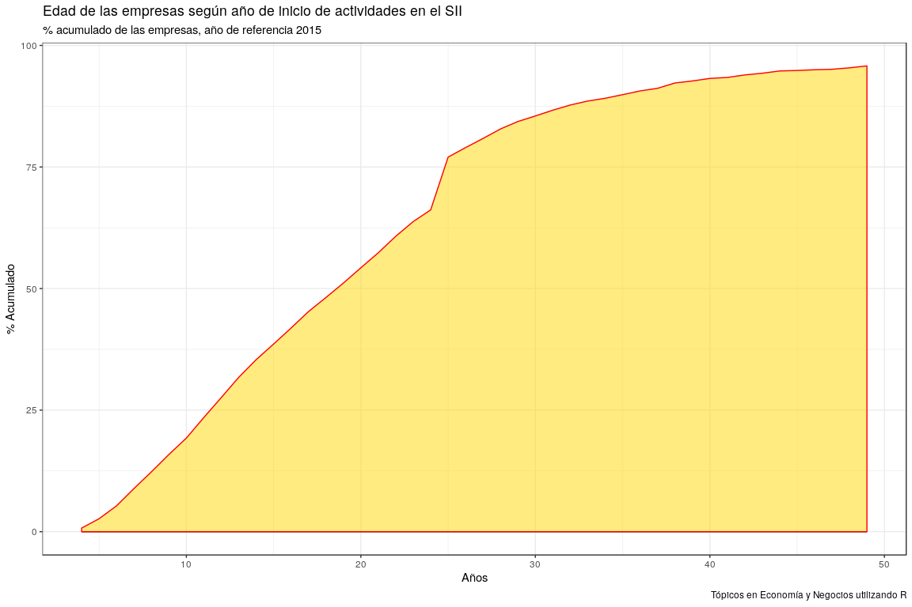
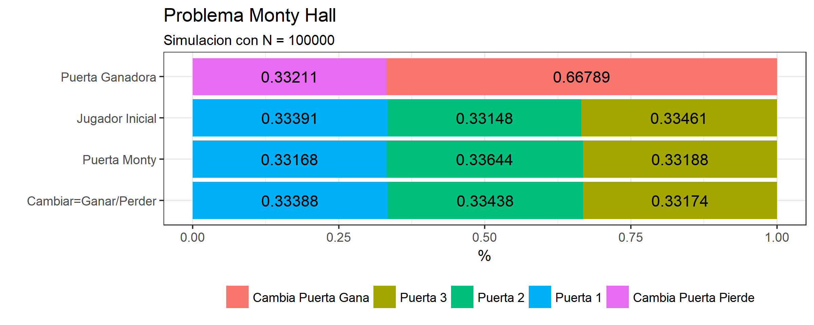
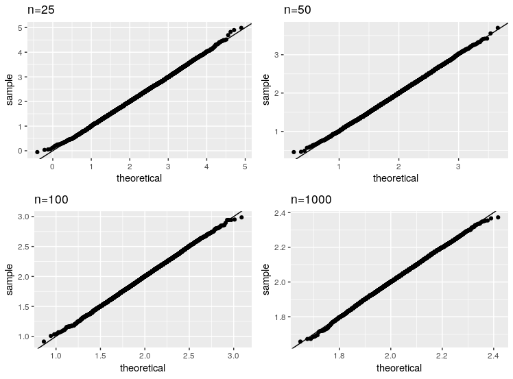

```{r setup, include=FALSE}
knitr::opts_chunk$set(echo = FALSE)

# Learn more about creating websites with Radix at:
# https://rstudio.github.io/radix/website.html

```

# Tarea 1

<p>

A paragraph with a floating image. A paragraph with a floating image. A paragraph with a floating image.

<button class="button" onclick="myFunction()"> 
[**Tarea 1**](autumn_2018/homeworks/HW1/HWS1.html)
</button>

</p>

---

# Tarea 2 

<p>

A paragraph with a floating image. A paragraph with a floating image. A paragraph with a floating image.  

<button class="button" onclick="myFunction()"> 
[**Tarea 2**](autumn_2018/homeworks/HW2/HWS2.html)
</button>

</p>

---

# Tarea 3

<p>

A paragraph with a floating image. A paragraph with a floating image. A paragraph with a floating image.  

<button class="button" onclick="myFunction()"> 
[**Tarea 3**](autumn_2018/homeworks/HW3/HWS3.html)
</button>

</p>

---

# Tarea 4

<p>

A paragraph with a floating image. A paragraph with a floating image. A paragraph with a floating image.  

<button class="button" onclick="myFunction()"> 
[**Tarea 4**](autumn_2018/homeworks/HW4/HWS4.html)
</button>

</p>

