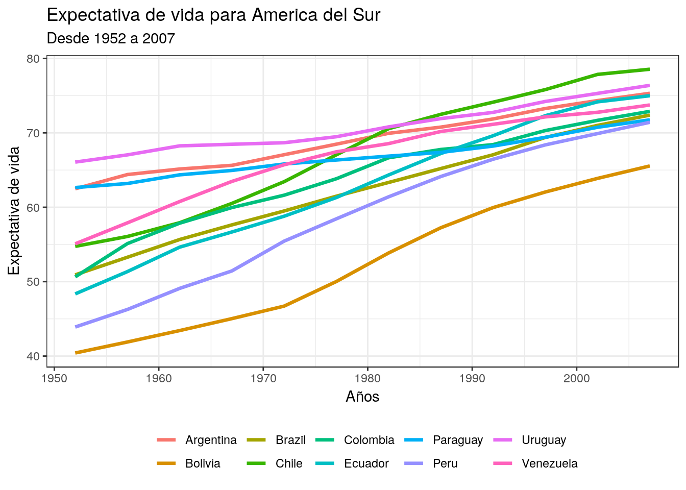
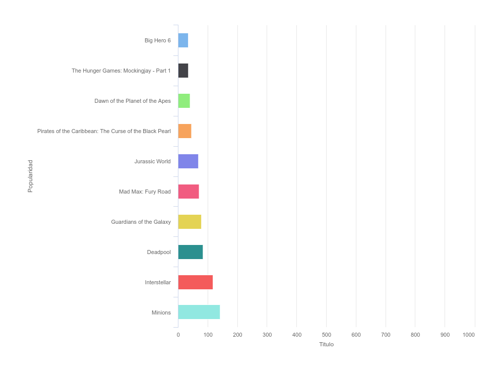

```{r setup, include=FALSE}
knitr::opts_chunk$set(echo = FALSE)

# Learn more about creating websites with Radix at:
# https://rstudio.github.io/radix/website.html

```

# Tarea 1 `r emo::ji("movie_camera")`

<p>

El objetivo de la Tarea 1 es introducir el uso de la librería `dplyr` y `magrittr` con su operador %>%, ambos coexisten en el `tidyverse`. La base de datos usada proviene de IMdB.

<button class="button" onclick="myFunction()"> 
[**Tarea 1**](spring_2018//homeworks/HW1/HWS1.html)
</button>

</p>

---

# Tarea 2 `r emo::ji("chart_with_upwards_trend")`

<p>

El objetivo de la tarea 2 es relacionar el uso  de R con las finanzas. Utilizando la librería `tidyquant`, calculamos bandas de *bollinger* y *barcharts*. Finalmente se usa la librería `WDI` para descargar datos externos a R como el *World Development Indicator*.   

<button class="button" onclick="myFunction()"> 
[**Tarea 2**](spring_2018/homeworks/HW2/HWS2.html)
</button>

</p>

---

# Tarea 3 `r emo::ji("globe_with_meridians")`

<p>

A paragraph with a floating image. A paragraph with a floating image. A paragraph with a floating image.  

<button class="button" onclick="myFunction()"> 
[**Tarea 3**](spring_2018/homeworks/HW3/HWS3.html)
</button>

</p>

---

# Tarea 4 `r emo::ji("world_map")`

<p>

A paragraph with a floating image. A paragraph with a floating image. A paragraph with a floating image.

<button class="button" onclick="myFunction()"> 
[**Tarea 4**](spring_2018/homeworks/HW4/HWS4.html)
</button>

</p>

